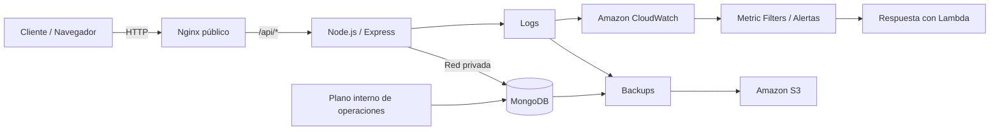

# AeroOps AWS — Servicio Público de Reservaciones

[English](README.md) · [Español](README.es.md)

> Capa pública de una simulación de reservaciones desplegada con una arquitectura de dos niveles en AWS, separando el tráfico de clientes del plano interno de operaciones y datos.

> **Proyecto de portafolio / simulación educativa.** No está afiliado, respaldado ni operado por Aeroméxico.

## El reto

El objetivo principal no fue únicamente construir una interfaz de vuelos, sino modelar una arquitectura con límites de confianza claros:

- publicar únicamente la capa web necesaria para clientes;
- mantener base de datos y administración en el lado interno;
- contenerizar los servicios para despliegues repetibles;
- diseñar observabilidad orientada a CloudWatch;
- automatizar ciclo de vida, logs y respaldos hacia S3.

El repositorio complementario **[AeroOps AWS — Internal Operations & Data Plane](https://github.com/armaabetancourtt/priv-profinaldevops)** contiene el panel administrativo, API protegida y MongoDB.

## Arquitectura



## Qué construí

- Búsqueda por origen, destino y fecha.
- Generación de opciones de vuelo desde rutas persistidas.
- Simulación de precios según demanda/fecha y disponibilidad.
- Reservaciones persistidas en MongoDB.
- Nginx como única entrada pública.
- Backend aislado dentro de la red Docker.
- Docker Compose, Winston y scripts Bash operativos.
- Flujo de monitoreo y respaldos orientado a AWS.

## Stack

HTML/CSS/JavaScript · Vue 3 · Nginx · Node.js · Express · MongoDB · Mongoose · Docker · Docker Compose · Bash · AWS EC2 · CloudWatch · S3

## Ejecución local

```bash
git clone https://github.com/armaabetancourtt/public-profinaldevops.git
cd public-profinaldevops
cp .env.example .env
# Configura MONGO_URI

docker compose up -d --build
```

Abre `http://localhost:8080`.

El backend no se publica directamente al host; Nginx enruta `/api/*` dentro de la red Docker.

## Endpoints

| Método | Endpoint | Uso |
|---|---|---|
| GET | `/api/flights` | Buscar vuelos |
| POST | `/api/book` | Crear reservación |
| GET | `/api/bookings` | Consultar reservaciones recientes |
| GET | `/api/routes` | Listar rutas |
| POST | `/api/routes` | Crear ruta |
| GET | `/api/health` | Health check |

## Decisiones técnicas

- **Un solo ingreso público:** Nginx funciona como reverse proxy y evita publicar directamente el API.
- **Configuración fuera del código:** valores de infraestructura se inyectan con variables de entorno.
- **Separación de responsabilidades:** tráfico público y administración interna viven en planos distintos.
- **Observabilidad diseñada desde el inicio:** logs persistentes y preparados para recolección/alertas.

Consulta [docs/ARCHITECTURE.md](docs/ARCHITECTURE.md) para el detalle técnico y [SECURITY.md](SECURITY.md) para el modelo de seguridad.
