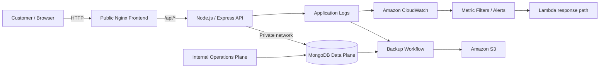

# AeroOps AWS — Public Flight Reservation Service

[English](README.md) · [Español](README.es.md)

> Internet-facing half of a two-tier AWS flight-reservation simulation, designed to separate customer traffic from an internal operations and data plane.


> **Portfolio project / educational simulation.** This project is not affiliated with, endorsed by, or operated by Aeroméxico.

## Why this project matters

The interesting part is not the airline UI. The goal was to model a small production-style system in AWS with a clear trust boundary:

- expose only the customer-facing web tier to Internet traffic;
- keep the database and administration services on the internal side;
- containerize the application for repeatable deployment;
- centralize logs for CloudWatch-oriented observability;
- automate startup, shutdown, log inspection, and S3 backup workflows.

The companion repository, **[AeroOps AWS — Internal Operations & Data Plane](https://github.com/armaabetancourtt/priv-profinaldevops)**, contains the internal administration service and MongoDB data plane.

## Architecture



### Repository split

| Repository | Responsibility | Exposure |
|---|---|---|
| **This repository** | Customer-facing flight search, pricing simulation, booking API and public web UI | Internet-facing frontend |
| [`priv-profinaldevops`](https://github.com/armaabetancourtt/priv-profinaldevops) | Admin dashboard, JWT-protected operations API, MongoDB and operational analytics | Internal / restricted |

A deeper architecture walkthrough is available in [docs/ARCHITECTURE.md](docs/ARCHITECTURE.md).

## What I built

### Customer experience
- Search flights by origin, destination and date.
- Generate a realistic set of flight options from persisted route data.
- Simulate demand-sensitive pricing and seat availability.
- Create and persist reservations in MongoDB.
- Expose a health endpoint for operational checks.

### Platform / DevOps
- Nginx frontend acting as the only public application entry point.
- Express backend isolated inside the Docker network.
- Docker Compose for repeatable service orchestration.
- Winston application logs persisted in a Docker volume.
- Bash workflows for deployment, lifecycle management, log inspection and backups.
- AWS-oriented monitoring and backup flow using CloudWatch and S3.
- Configuration injected through environment variables instead of repository secrets.

## Technology

| Layer | Stack |
|---|---|
| Frontend | HTML5, CSS3, JavaScript, Vue 3 (CDN), Nginx |
| API | Node.js, Express |
| Data | MongoDB 6 / Mongoose |
| Containers | Docker, Docker Compose |
| Observability | Winston, Amazon CloudWatch |
| Cloud operations | AWS EC2, VPC networking, S3, Lambda-oriented alert response |
| Automation | Bash |

## Run locally

This public tier expects a reachable MongoDB instance. For the full two-repository topology, run the internal data-plane repository first.

```bash
git clone https://github.com/armaabetancourtt/public-profinaldevops.git
cd public-profinaldevops

cp .env.example .env
# Set MONGO_URI to your MongoDB endpoint.

docker compose up -d --build
```

Open:

```text
http://localhost:8080
```

Only Nginx is published to the host. The Express API remains inside the Compose network and is reached through Nginx at `/api/*`.

## API surface

| Method | Endpoint | Purpose |
|---|---|---|
| `GET` | `/api/flights` | Search generated flight options |
| `POST` | `/api/book` | Create a reservation |
| `GET` | `/api/bookings` | Retrieve recent reservations |
| `GET` | `/api/routes` | List stored routes |
| `POST` | `/api/routes` | Create a route |
| `GET` | `/api/health` | Service health check |

## Operational commands

```bash
./scripts/start_app.sh
./scripts/view_logs.sh
./scripts/backup.sh
./scripts/backup.sh --s3 <bucket-name>
./scripts/stop_app.sh
```

The public-tier backup script archives application logs. Database backups belong to the internal data-plane repository, where MongoDB actually runs.

## Design decisions

**One public ingress.** Nginx proxies `/api/*` to the backend, so the application does not need to publish the API container directly.

**Configuration outside source control.** Infrastructure-specific values such as the MongoDB endpoint are supplied through `.env`, making the repository portable and avoiding hard-coded private IPs.

**Separate operational concerns.** Public booking traffic and internal administration live in different repositories and service boundaries rather than in one monolithic deployment.

**Observability as part of the design.** Logs are persistent and intentionally structured for host/cloud collection rather than treated as an afterthought.

## Security notes

- No AWS credentials, database credentials, personal contact information, or private keys belong in this repository.
- `.env`, local backups and logs are ignored by Git.
- CORS is disabled by default for cross-origin traffic; set `CORS_ORIGIN` only when an external origin is intentionally required.
- The project uses fictional/demo reservation data only.

See [SECURITY.md](SECURITY.md) for the repository security model.

## Project status

Built as a hands-on cloud/DevOps architecture project to demonstrate application delivery across networking, containers, observability, automation and data persistence — not as a production airline platform.
