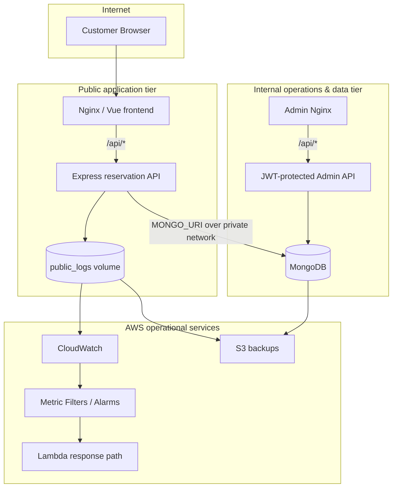

# Architecture

## System goal

This project models a small airline-reservation platform with a deliberate separation between an Internet-facing customer tier and an internal operations/data tier.

The split exists to demonstrate a core cloud-design principle: **public reachability and data/administrative reachability should not be the same thing**.

## Logical topology

## Public tier

### Nginx frontend
Nginx serves the Vue-based SPA and proxies `/api/*` requests to the Express service by Docker service name. The backend therefore does not need a host-published port.

### Reservation API
The Express API:
- stores route and booking data through Mongoose;
- generates flight options from stored routes;
- simulates price and seat availability;
- exposes a health endpoint;
- writes structured logs through Winston.

## Data boundary

The public repository does **not** run MongoDB. It receives the database endpoint through `MONGO_URI`, which allows the database to live on the internal/private side of the architecture.

This removes the hard-coded private IP that was previously stored in Compose and makes the topology portable between local and AWS deployments.

## Observability

Application logs are persisted in a Docker volume. In the AWS deployment design, those logs are collected by CloudWatch and can be evaluated by metric filters/alarms. The project also includes a Lambda-oriented response path used for operational alerting exercises.

## Backup responsibility

The public host is responsible for its application logs. MongoDB backups belong to the internal data-plane repository, where the database service runs. Both workflows can upload artifacts to S3.

## Trade-offs

This is a portfolio-scale architecture, not a production airline platform. A production version would typically add:
- TLS termination and managed DNS;
- an Application Load Balancer;
- a managed database service with authentication and encryption;
- IAM roles with least privilege;
- Secrets Manager / Parameter Store;
- autoscaling and multi-AZ resilience;
- CI/CD and automated infrastructure provisioning;
- rate limiting, WAF controls, audit logging and stronger input validation.
